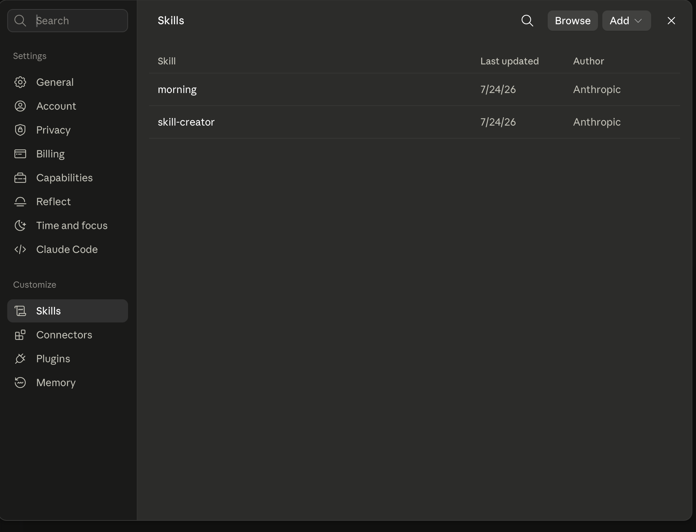
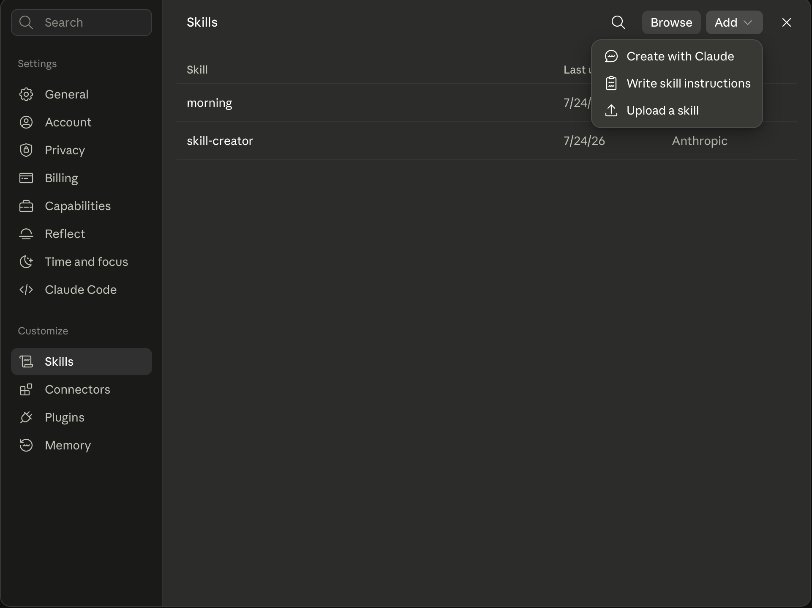
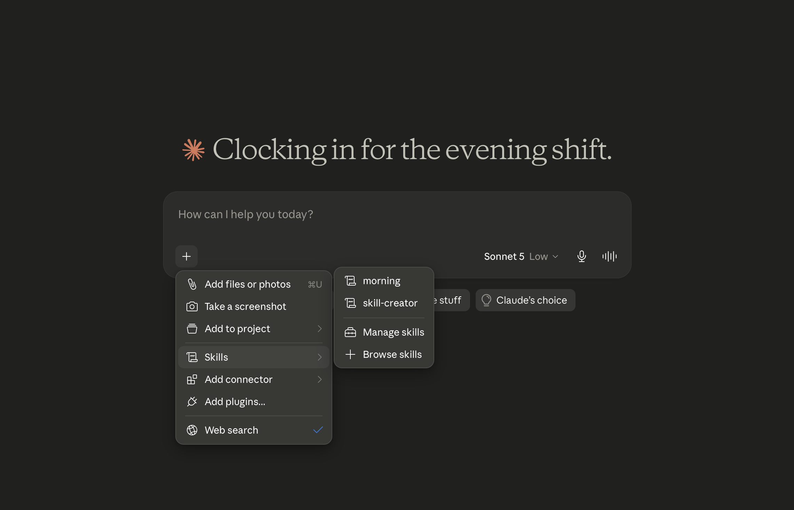
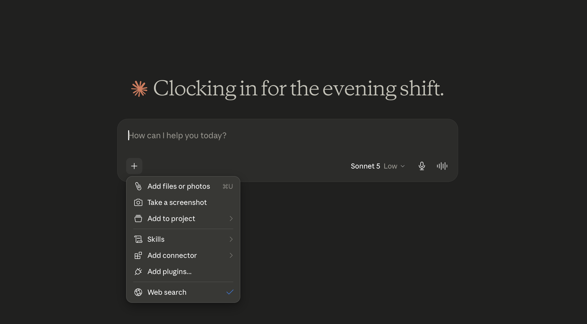
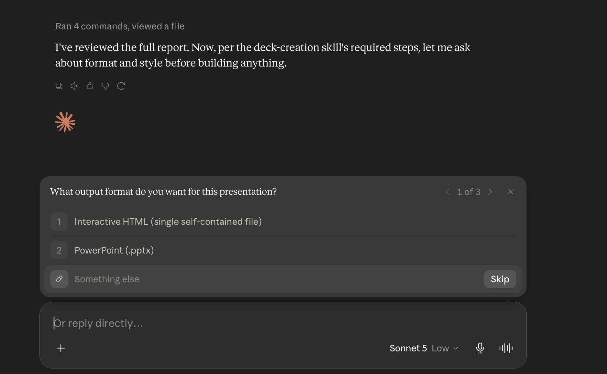

# Interactive HTML Deck Creator — Claude Skill

Turn ideas, notes, documents, or reports into a polished, self-contained, interactive presentation — built by Claude as a single HTML file (or as a PowerPoint, if you prefer).

This is a **Claude Skill**: a markdown file that teaches Claude a repeatable, opinionated workflow. Once uploaded, Claude will treat itself less like a slide generator and more like a presentation designer — asking the right questions before it builds anything and creating professional and quality slides

## What it does

- Converts markdown, documents, reports, PDFs, or plain ideas into a slide deck
- Asks you up front which **output format** you want:
  - a single self-contained interactive HTML file (Tailwind CSS + vanilla JS, no frameworks, no build tools, no server), or
  - a PowerPoint (`.pptx`)
- Asks which **visual style** fits your vision (Apple Product Reveal, Linear, Stripe, OpenAI, Vercel, Notion, Glassmorphism, Cyberpunk, Luxury Black, and more)
- Designs every slide around one idea at a time, using visual hierarchy, whitespace, and real components (charts, icons, timelines, step flows) instead of dense text
- Ships a working component library and interaction pattern (keyboard navigation, nav dots, prev/next controls, ambient background) baked into the HTML output, so decks are demo-ready with minimal editing

## What's in this repo

| File | Description |
|---|---|
| `interactive-html-deck-creator-skill.md` | The Skill file itself — upload this to Claude |
| `README.md` | The document introducing you the Skill file and how to use it|

## How to use it with Claude

Claude Skills let you extend Claude with custom instructions and reusable workflows, and getting this one set up takes less than a minute. Start by downloading `interactive-html-deck-creator-skill.md` from this repo onto your computer. Then, in [claude.ai](https://claude.ai) (web or desktop app), open the left sidebar and click **Settings**, then find **Skills** under the **Customize** section near the bottom of the settings menu (it sits alongside Connectors, Plugins, and Memory). This takes you to a page listing all your currently installed skills — by default you'll likely just see Anthropic's built-in ones like `morning` and `skill-creator`, as shown below.

From here, click the **Add** dropdown in the top-right corner of the Skills page. A small menu will drop down with three options: "Create with Claude," "Write skill instructions," and "Upload a skill," as pictured below.

Click **Upload a skill**, and select the `interactive-html-deck-creator-skill.md` file you downloaded earlier. It'll now appear in your Skills list, ready to use in any conversation. You don't need to "activate" it every time — once it's uploaded, it's available account-wide.

To actually use it, open a normal chat and either just describe what you want (e.g. "turn this report into a pitch deck"), or explicitly attach the skill for that message. You can do this by clicking the **+** button beside the chat box, hovering over **Skills** in the popup menu, and selecting it from the flyout list that appears alongside your other installed skills (`morning`, `skill-creator`, etc.), as shown here:

Once the skill is engaged, Claude will follow its script exactly: before generating anything, it reads through whatever content you've given it, then stops to ask you a required, numbered question about output format — Interactive HTML or PowerPoint — the same way it's designed to always ask before building, as seen in the screenshot below.

Just tap or type your answer, then answer the follow-up style question (Apple Product Reveal, Linear, Stripe, Glassmorphism, etc.) and any other clarifying questions Claude raises. Once you've answered everything, Claude will generate the deck as an artifact you can preview inline, download, and open directly in a browser (for HTML) or in PowerPoint.

## Example output

The generated HTML decks include:
- A title slide, content slides (grids, process flows, stat highlights), and a closing slide
See the `/screenshots` folder in this repo for the walkthrough images referenced above, showing the Skills upload flow and the discovery-question flow in action.

## Additional Notes and Reccomendations for using:

- A well written prompt is reccomended but not required, should the information given be unadequate, Claude will ask you for them as instructed

- A personal preference is Luxury Black for formal presentations and Glassmorphism for everyday uses 

